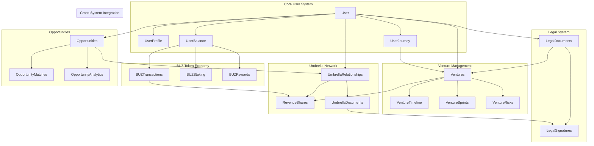
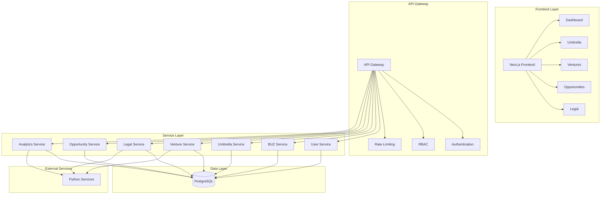
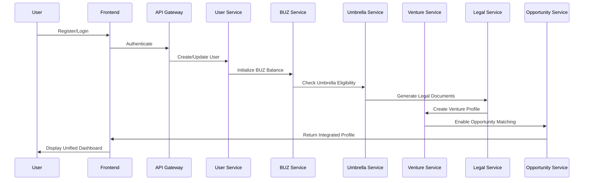
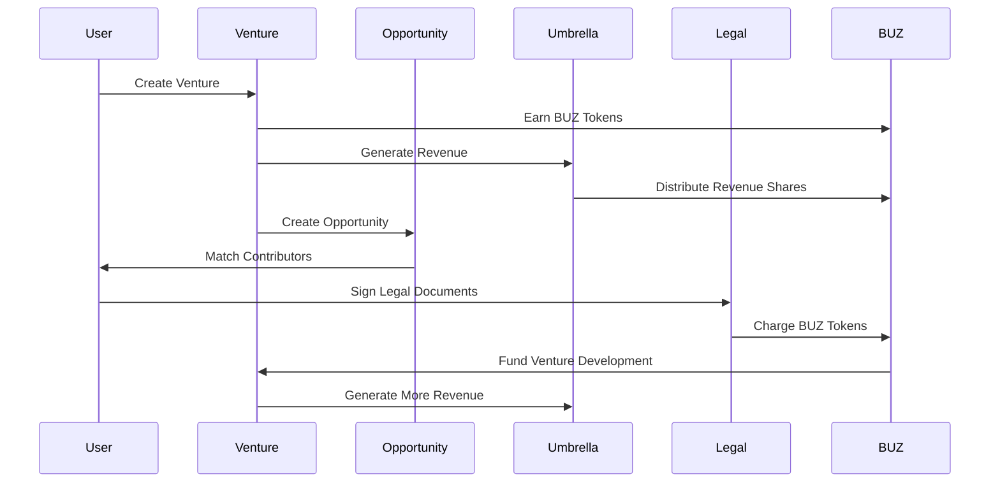

# 🚀 SmartStart Unified System Integration Architecture

**Version:** 1.0  
**Last Updated:** December 2025  
**Status:** Implementation Ready

---

## 🎯 **INTEGRATION OVERVIEW**

This document outlines the comprehensive integration of all SmartStart systems into a unified, cohesive platform that seamlessly connects:

- **🌂 Private Umbrella System** - Referral and revenue sharing network
- **🚀 Venture Management System** - 30-day venture launch management
- **💰 BUZ Token System** - Universal token economy
- **📋 Legal System** - Document management and compliance
- **🔍 Opportunities System** - Matching and collaboration
- **📊 Analytics System** - Comprehensive reporting and insights

---

## 🏗️ **UNIFIED ARCHITECTURE**

### **1. Database Integration Layer**



### **2. API Integration Architecture**



---

## 🔄 **CROSS-SYSTEM INTEGRATION POINTS**

### **1. BUZ Token Integration**

#### **Universal Token Economy**
- **Earning**: Users earn BUZ tokens across all platform activities
- **Spending**: Tokens can be spent on any platform feature or service
- **Staking**: Tokens can be staked for rewards and governance power
- **Governance**: Staked tokens provide voting power for platform decisions

#### **Integration Points**
```typescript
// BUZ Token Integration Interface
interface BUZIntegration {
  // Earning mechanisms
  earnTokens(activity: PlatformActivity, amount: number): Promise<void>
  
  // Spending mechanisms
  spendTokens(service: PlatformService, amount: number): Promise<boolean>
  
  // Staking mechanisms
  stakeTokens(amount: number, duration: number): Promise<StakingPosition>
  
  // Governance mechanisms
  voteOnProposal(proposalId: string, vote: VoteType): Promise<void>
}
```

### **2. Umbrella Network Integration**

#### **Revenue Sharing Integration**
- **Venture Revenue**: Umbrella relationships earn from venture project revenue
- **Opportunity Revenue**: Referrals through opportunities generate revenue shares
- **Legal Revenue**: Legal document usage generates revenue for umbrella participants
- **Cross-Platform Revenue**: Revenue from all platform activities

#### **Integration Points**
```typescript
// Umbrella Integration Interface
interface UmbrellaIntegration {
  // Revenue sharing
  calculateRevenueShares(projectId: string, revenue: number): Promise<RevenueShare[]>
  
  // Relationship management
  createUmbrellaRelationship(referrerId: string, referredId: string): Promise<UmbrellaRelationship>
  
  // Document management
  generateUmbrellaAgreement(relationshipId: string): Promise<UmbrellaDocument>
  
  // Analytics
  getUmbrellaAnalytics(userId: string, period: string): Promise<UmbrellaAnalytics>
}
```

### **3. Venture Management Integration**

#### **30-Day Launch Integration**
- **BUZ Rewards**: Ventures earn BUZ tokens for milestones and achievements
- **Umbrella Integration**: Venture success generates revenue for umbrella participants
- **Legal Integration**: Automated legal document generation for venture phases
- **Opportunity Integration**: Venture opportunities matched with suitable contributors

#### **Integration Points**
```typescript
// Venture Management Integration Interface
interface VentureIntegration {
  // Timeline management
  createVentureTimeline(ventureId: string, duration: number): Promise<VentureTimeline>
  
  // Sprint management
  createSprint(ventureId: string, sprintData: SprintData): Promise<VentureSprint>
  
  // Risk management
  trackRisk(ventureId: string, risk: RiskData): Promise<VentureRisk>
  
  // Analytics
  getVentureAnalytics(ventureId: string): Promise<VentureAnalytics>
}
```

### **4. Legal System Integration**

#### **Document Management Integration**
- **Automated Generation**: Legal documents generated based on platform activities
- **Digital Signatures**: Integrated signature system across all document types
- **Compliance Tracking**: Automated compliance monitoring and reporting
- **BUZ Integration**: Legal services cost BUZ tokens

#### **Integration Points**
```typescript
// Legal System Integration Interface
interface LegalIntegration {
  // Document generation
  generateDocument(type: DocumentType, context: DocumentContext): Promise<LegalDocument>
  
  // Signature management
  signDocument(documentId: string, signerId: string): Promise<DocumentSignature>
  
  // Compliance tracking
  checkCompliance(entityId: string, entityType: string): Promise<ComplianceStatus>
  
  // Analytics
  getLegalAnalytics(entityId: string): Promise<LegalAnalytics>
}
```

### **5. Opportunities Integration**

#### **Matching and Collaboration**
- **Smart Matching**: AI-powered matching based on skills, experience, and goals
- **BUZ Rewards**: Successful matches and collaborations earn BUZ tokens
- **Umbrella Integration**: Opportunity referrals generate umbrella revenue
- **Venture Integration**: Opportunities connected to venture projects

#### **Integration Points**
```typescript
// Opportunities Integration Interface
interface OpportunityIntegration {
  // Matching
  findMatches(userId: string, criteria: MatchCriteria): Promise<OpportunityMatch[]>
  
  // Application management
  applyToOpportunity(opportunityId: string, userId: string): Promise<Application>
  
  // Collaboration tracking
  trackCollaboration(opportunityId: string, participants: string[]): Promise<Collaboration>
  
  // Analytics
  getOpportunityAnalytics(opportunityId: string): Promise<OpportunityAnalytics>
}
```

---

## 📊 **UNIFIED DATA FLOW**

### **1. User Journey Integration**



### **2. Cross-System Activity Flow**



---

## 🎨 **UNIFIED FRONTEND INTEGRATION**

### **1. Dashboard Integration**

```typescript
// Unified Dashboard Component
interface UnifiedDashboard {
  // BUZ Token Overview
  buzBalance: number
  buzEarnings: number
  buzStaking: StakingPosition[]
  
  // Umbrella Network
  umbrellaRelationships: UmbrellaRelationship[]
  umbrellaRevenue: number
  umbrellaAnalytics: UmbrellaAnalytics
  
  // Venture Management
  activeVentures: Venture[]
  ventureProgress: VentureProgress[]
  ventureRisks: VentureRisk[]
  
  // Opportunities
  availableOpportunities: Opportunity[]
  appliedOpportunities: Application[]
  opportunityMatches: OpportunityMatch[]
  
  // Legal
  pendingDocuments: LegalDocument[]
  complianceStatus: ComplianceStatus[]
  legalAnalytics: LegalAnalytics
  
  // Analytics
  platformAnalytics: PlatformAnalytics
  userAnalytics: UserAnalytics
}
```

### **2. Navigation Integration**

```typescript
// Unified Navigation Structure
const navigation = [
  { name: 'Dashboard', href: '/dashboard', icon: Home, badge: 'unified' },
  { name: 'Ventures', href: '/ventures', icon: Building2, badge: 'venture' },
  { name: 'Umbrella', href: '/umbrella', icon: Network, badge: 'umbrella' },
  { name: 'Opportunities', href: '/opportunities', icon: Search, badge: 'opportunity' },
  { name: 'Legal', href: '/legal', icon: FileText, badge: 'legal' },
  { name: 'BUZ Tokens', href: '/buz', icon: Coins, badge: 'buz' },
  { name: 'Analytics', href: '/analytics', icon: BarChart3, badge: 'analytics' },
  { name: 'Settings', href: '/settings', icon: Settings, badge: 'settings' }
]
```

---

## 🔧 **IMPLEMENTATION ROADMAP**

### **Phase 1: Core Integration (Week 1-2)**
- [ ] Unified database schema updates
- [ ] Cross-system API integration
- [ ] BUZ token integration across all systems
- [ ] Basic frontend integration

### **Phase 2: Advanced Features (Week 3-4)**
- [ ] Umbrella revenue sharing integration
- [ ] Venture management integration
- [ ] Legal document automation
- [ ] Opportunity matching integration

### **Phase 3: Analytics & Optimization (Week 5-6)**
- [ ] Unified analytics dashboard
- [ ] Cross-system performance monitoring
- [ ] User experience optimization
- [ ] System performance tuning

### **Phase 4: Testing & Deployment (Week 7-8)**
- [ ] Comprehensive integration testing
- [ ] User acceptance testing
- [ ] Performance testing
- [ ] Production deployment

---

## 📈 **SUCCESS METRICS**

### **Integration Metrics**
- **Cross-System Usage**: 80% of users engage with multiple systems
- **BUZ Token Circulation**: 90% of platform activities involve BUZ tokens
- **Umbrella Participation**: 60% of users participate in umbrella network
- **Venture Success**: 70% of ventures complete 30-day launch timeline
- **Opportunity Matching**: 85% success rate for opportunity matches

### **User Experience Metrics**
- **Unified Dashboard Usage**: 95% of users use unified dashboard
- **Cross-System Navigation**: 90% of users navigate between systems
- **Feature Discovery**: 80% of users discover new features through integration
- **User Satisfaction**: 90% user satisfaction with integrated experience

### **Business Metrics**
- **Revenue Growth**: 50% increase in platform revenue through integration
- **User Retention**: 40% improvement in user retention
- **Network Effects**: 60% increase in network effects
- **Platform Value**: 100% increase in platform value proposition

---

## 🎉 **CONCLUSION**

The unified system integration creates a cohesive, powerful platform where all systems work together seamlessly. Users can:

- **Earn BUZ tokens** across all platform activities
- **Participate in umbrella networks** for revenue sharing
- **Manage ventures** with integrated legal and opportunity systems
- **Find opportunities** through smart matching
- **Access legal services** with automated document generation
- **Track analytics** across all platform activities

This integration transforms SmartStart from a collection of separate systems into a unified, powerful platform that creates exponential value for all participants.

---

*For technical implementation details, see the individual system documentation and implementation guides.*
